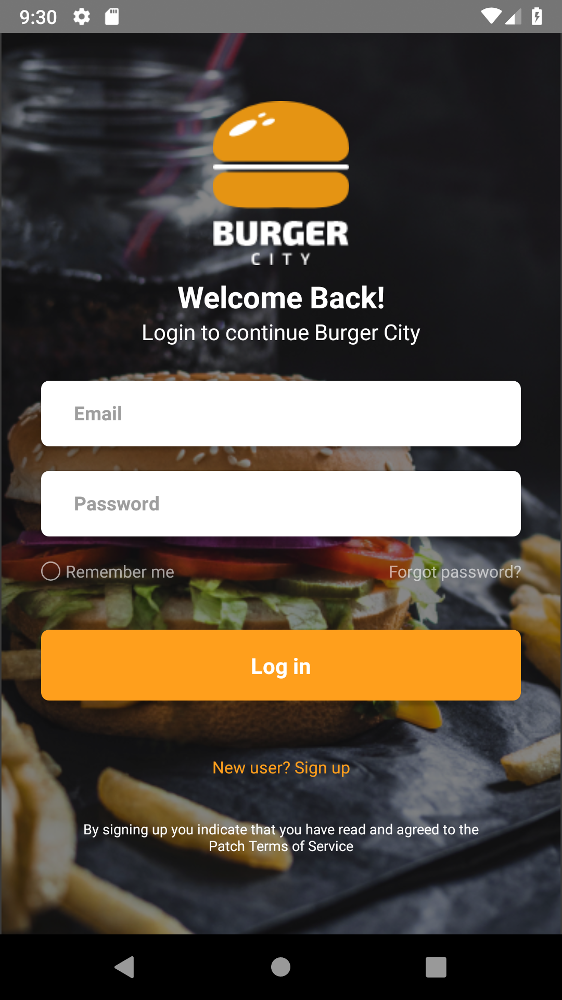
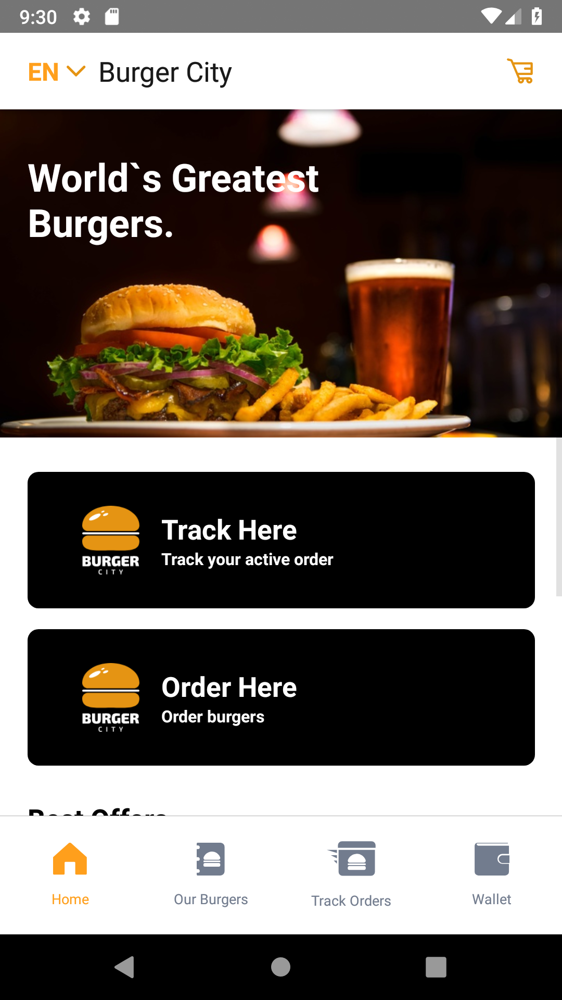
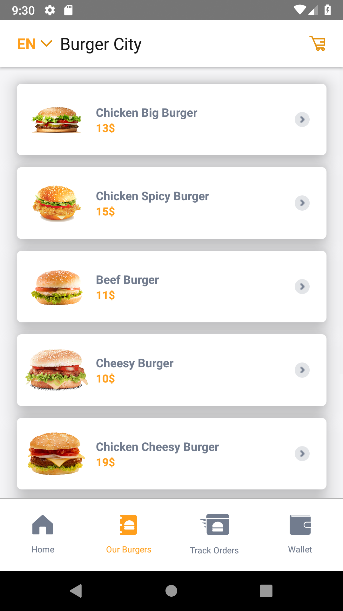
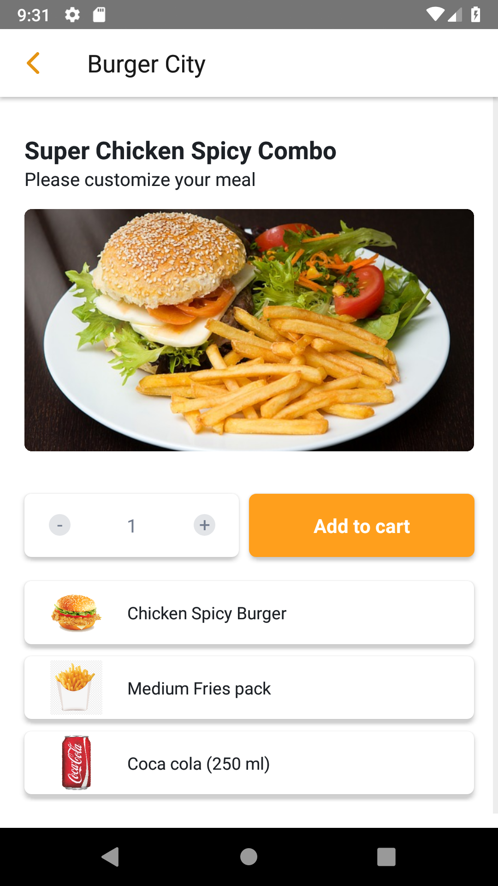

# Burger City

Design: https://www.behance.net/gallery/77742735/Burger-City-Free-Adobe-XD-UI-kit

Demo ReactNative app made for comparison with Flutter (https://github.com/VladislavRUS/burger_city_flutter)

## Getting Started

To run app you need to place config.json file into assets folder with apiKey property:

```
{
   "apiKey": <YOUR_GOOGLE_API_KEY>
}
```

It is needed for address autocompletion and maps 

### Preview
ReactNative screenshots:

 |  |  |  
